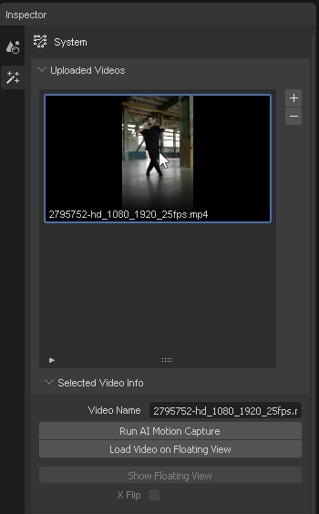
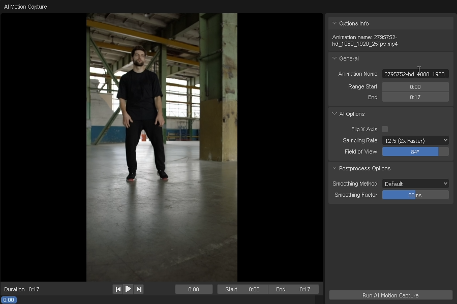
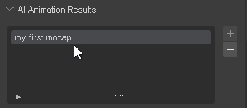

# Run AI Motion Capture

In this section, you will learn how to run AI motion capture.

1. Select the video to process. then click the "Run AI Motion Capture" button.

    

2. Set Animation Name and range to process. then click the "Run AI Motion Capture" button.

    

    You can adjust the "AI Options" to improve the result.

3. Wait for the processing to complete.

    

4. When the processing is complete, you can see the result in the "AI Animation Results" panel.

    

### Follow the steps with the video

import ReactPlayer from "react-player";
import ResultVideo from "./2024-10-22 20-20-44.mp4";

<ReactPlayer
    url={ResultVideo}
    controls={true}
    width="100%"
    height="100%"/>
