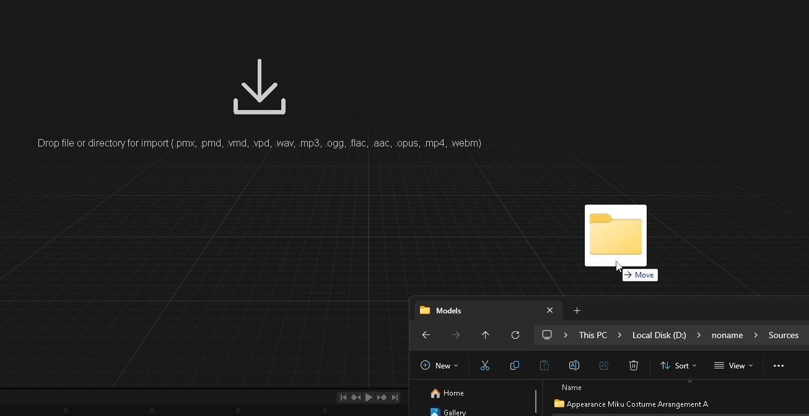
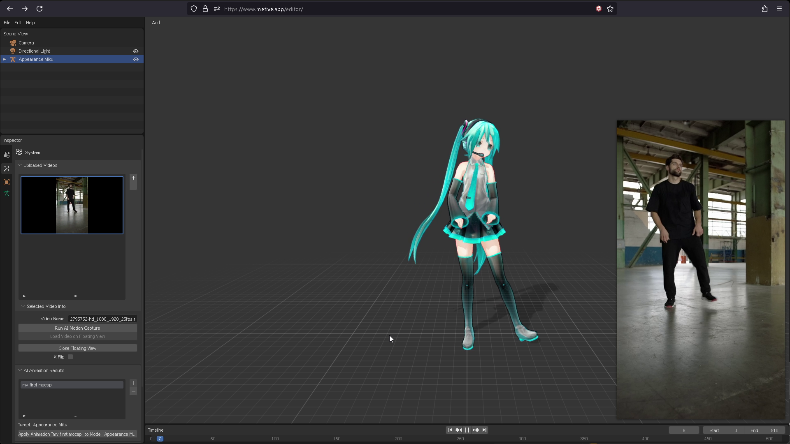

# Load Animation To Model

In this section, you will learn how to load an animation to the PMX model.

*We show examples of loading the PMX model with "Apearance Miku" created by [ままま](https://seiga.nicovideo.jp/seiga/im2703273).*

:::info
MMD model must have mmd standard bone(標準ボーン) and mmd semi-standard bone(準標準ボーン) for the animation to be applied correctly.

Appearance Miku model doen **NOT** have mmd semi-standard bone(準標準ボーン). So, please use other models like [Tda Miku](https://www.deviantart.com/mmd91/art/TDA-Hatsune-Miku-V4X-Style-Model-DL-Download-MMD-788834848) for the best result.
:::

1. Drag and drop the **folder that contains the PMX model** into the window.

    

    :::warning
    If you drag and drop the PMX model **file**, the model will be loaded without the texture.
    :::

2. Select the PMX model in file list. then click the "Import" button.
   
    

3. Select the Animation to load at the "AI Animation Results" panel. then click the "Apply Animation" button.
    
    

4. Animation is loaded to the PMX model.

    

5. Select Video on Upload Videos panel. then click the "Load Video on Floating View" button.

    

6. The video is loaded on the floating view. You can now see Input Video and Animation together.

    

### Follow the steps with the video

import ReactPlayer from "react-player";
import ResultVideo from "./2024-10-22 20-37-20.mp4";

<ReactPlayer
    url={ResultVideo}
    controls={true}
    width="100%"
    height="100%"/>
