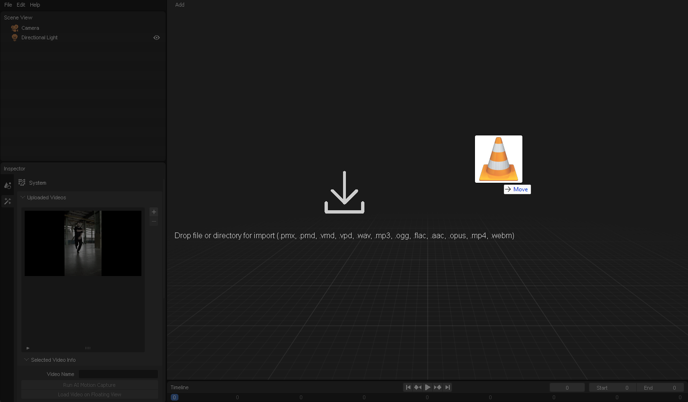
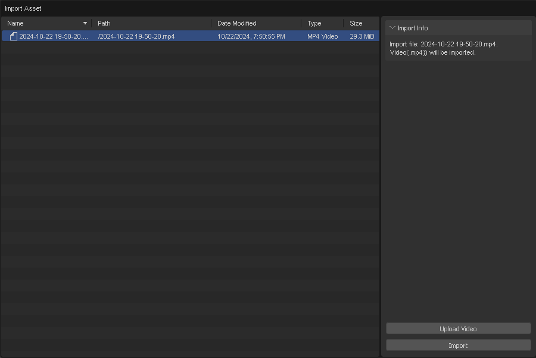
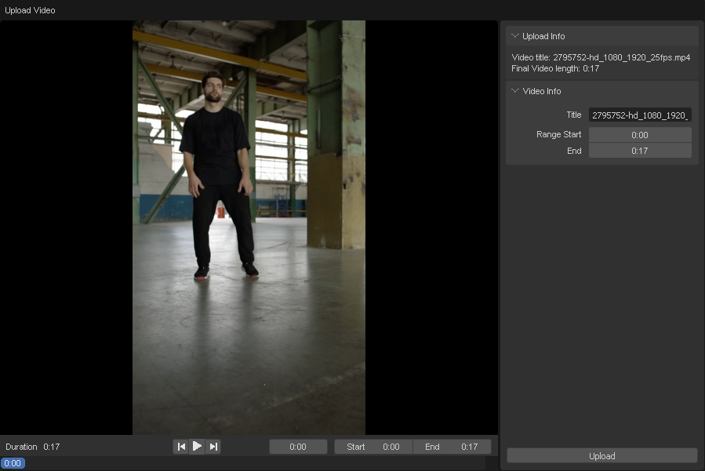

# ビデオのアップロード

このセクションでは、ビデオファイルのアップロード方法について学びます。

1. ビデオファイルをウィンドウにドラッグアンドドロップします。

    

    ビデオをアップロードするには、ビデオファイルをウィンドウにドラッグアンドドロップします。

2. 「Upload Video」ボタンをクリックします。

    

    その後、インポートダイアログが表示されます。ビデオファイルをアップロードするには、「Upload Video」を選択します。

3. ビデオ名とアップロード範囲を設定します。ビデオをアップロードするには、「Upload」をクリックします。

    

### 動画でステップを確認する

import ReactPlayer from "react-player";
import ResultVideo from "./2024-10-22 19-50-20.mp4";

<ReactPlayer
    url={ResultVideo}
    controls={true}
    width="100%"
    height="100%"/>
