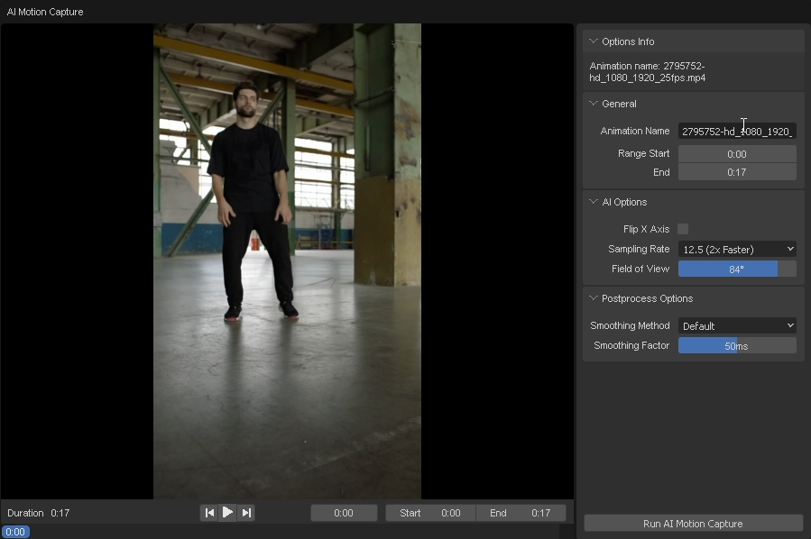

# AIモーションキャプチャーの実行

このセクションでは、AIモーションキャプチャーの実行方法について学びます。

1. 処理するビデオを選択します。その後、「Run AI Motion Capture」ボタンをクリックします。

    
    
2. アニメーション名と処理範囲を設定します。その後、「Run AI Motion Capture」ボタンをクリックします。

    

    「AI Options」を調整して結果を改善できます。

3. 処理が完了するのを待ちます。

    

4. 処理が完了すると、「AI Animation Results」パネルに結果が表示されます。

    

### 動画でステップを確認する

import ReactPlayer from "react-player";
import ResultVideo from "./2024-10-22 20-20-44.mp4";

<ReactPlayer
    url={ResultVideo}
    controls={true}
    width="100%"
    height="100%"/>
