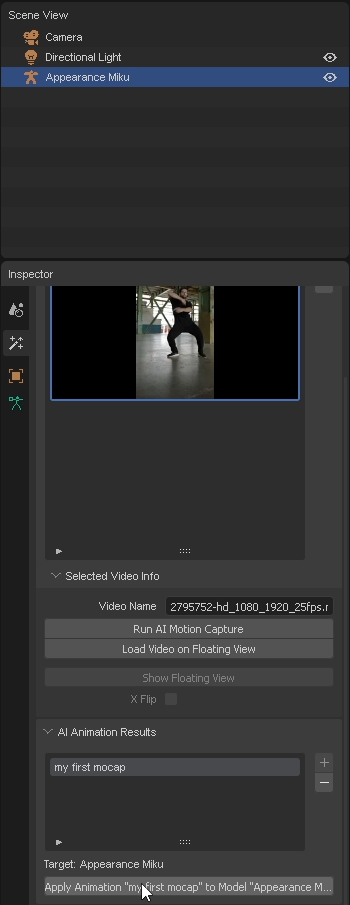

# アニメーションをモデルに読み込む

このセクションでは、PMXモデルにアニメーションをロードする方法を学びます。

*[ままま](https://seiga.nicovideo.jp/seiga/im2703273)さんが作成した「Apearance Miku」のPMXモデルを読み込む例を示します。*

:::info
MMDモデルには、アニメーションが正しく適用されるために、MMD標準ボーンおよびMMD準標準ボーンが必要です。

Appearance MikuモデルにはMMD準標準ボーン（準標準ボーン）が**含まれていません**。そのため、最良の結果を得るために、[Tda Miku](https://www.deviantart.com/mmd91/art/TDA-Hatsune-Miku-V4X-Style-Model-DL-Download-MMD-788834848)などの他のモデルを使用してください。
:::

1. **PMXモデルを含むフォルダ**をウィンドウにドラッグアンドドロップします。

    

    :::warning
    PMXモデル**ファイル**をドラッグアンドドロップすると、テクスチャなしでモデルがロードされます。
    :::

2. ファイルリストでPMXモデルを選択します。その後、「Import」ボタンをクリックします。

    

3. 「AI Animation Results」パネルでロードするアニメーションを選択します。その後、「Apply Animation」ボタンをクリックします。

    

4. アニメーションがPMXモデルにロードされます。

    

5. 「Uploaded Videos」パネルでビデオを選択します。その後、「Load Video on Floating View」ボタンをクリックします。

    

6. 「floating view」にビデオがロードされます。これで、入力ビデオとアニメーションを一緒に見ることができます。

    

### 動画でステップを確認する

import ReactPlayer from "react-player";
import ResultVideo from "./2024-10-22 20-37-20.mp4";

<ReactPlayer
    url={ResultVideo}
    controls={true}
    width="100%"
    height="100%"/>
