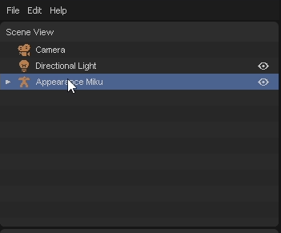
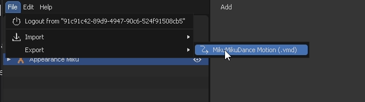
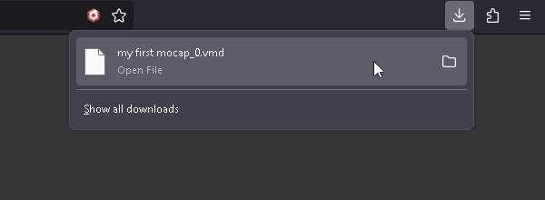

# Export Animation

In this section, you will learn how to export the animation as a VMD file.

1. Select the model that has the animation you want to export.

    

2. Click "File" -> "Export" -> "MikuMikuDance Motion (.vmd)".

    

3. Animation will be exported as a VMD file.

    

4. You can now use the exported VMD file in MMD software.

    

### Follow the steps with the video

import ReactPlayer from "react-player";
import ResultVideo from "./2024-10-22 21-02-13.mp4";

<ReactPlayer
    url={ResultVideo}
    controls={true}
    width="100%"
    height="100%"/>
