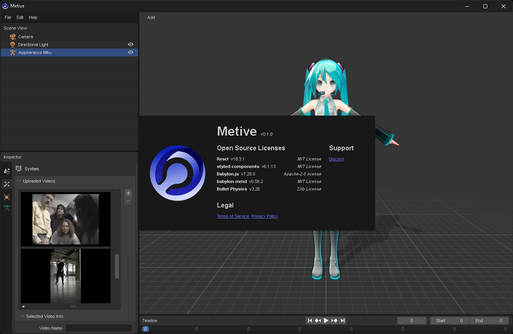

# Metive

Metive(発音: ミーティブ)は、2D動画から3Dアニメーションを作成できる、AIを活用したモーションキャプチャーサービスです。

## 機能

- MMD(PMX)モデルの読み込み
- 2D動画から3Dアニメーションの生成
- アニメーションのVMD形式へのエクスポート

## 使用方法

- [はじめに](./docs/category/getting-started) - クイックスタートガイド
- [FAQ](./docs/faq) - よくある質問

## Support

[Discord](https://discord.gg/cUTbtaufK2) - サポートとフィードバックのためのDiscordサーバーに参加してください。
