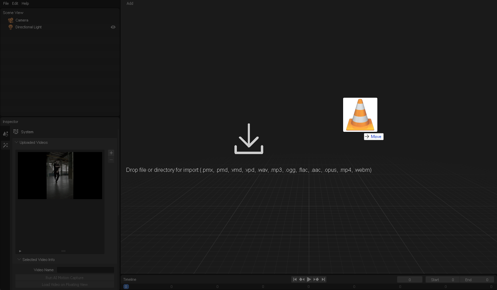
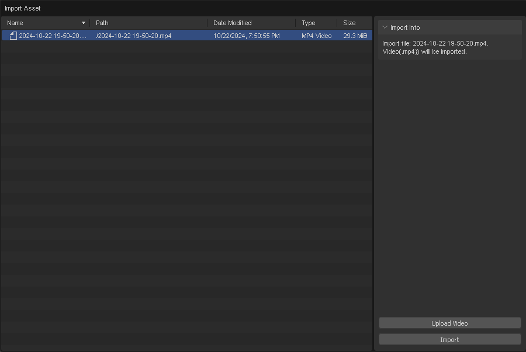

# Upload Video

In this section, you will learn how to upload a video file.

1. Drag and drop the video file into the window.

    

    For uploading a video, you can drag and drop the video file into window.

2. Click the "Upload Video" button.
    

    Then, the import dialog will appear. Select "Upload Video" to upload the video file.

3. Set the video name and range to upload. Click "Upload" to upload the video.
    

### Follow the steps with the video

import ReactPlayer from "react-player";
import ResultVideo from "./2024-10-22 19-50-20.mp4";

<ReactPlayer
    url={ResultVideo}
    controls={true}
    width="100%"
    height="100%"/>
