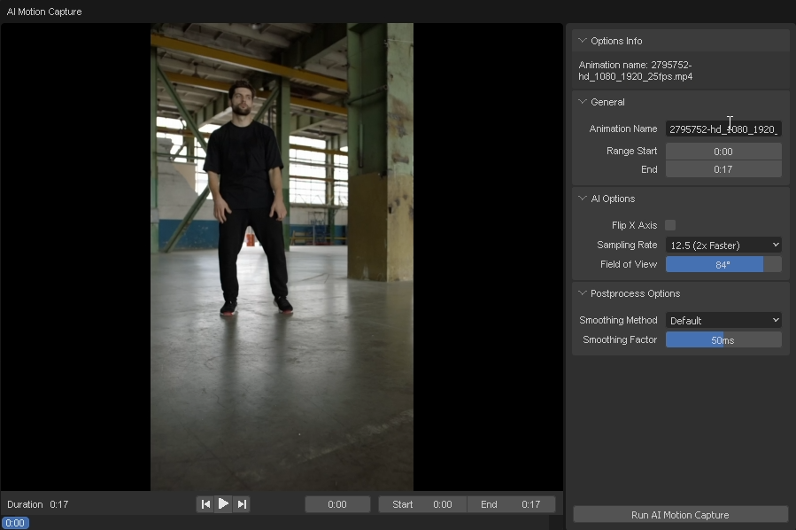
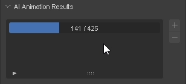

# AI 모션 캡처 실행하기

이 섹션에서는 AI 모션 캡처를 실행하는 방법을 배웁니다.

1. 처리할 비디오를 선택한 다음 "Run AI Motion Capture" 버튼을 클릭합니다.

    

2. 처리할 애니메이션 이름과 범위를 설정한 다음 "Run AI Motion Capture" 버튼을 클릭합니다.

    

    "AI Options"를 조정하여 결과를 개선할 수 있습니다.

3. 처리가 완료될 때까지 기다립니다.

    

4. 처리가 완료되면 "AI Animation Results" 패널에서 결과를 확인할 수 있습니다.

    

### 동영상으로 단계 따라하기

import ReactPlayer from "react-player";
import ResultVideo from "./2024-10-22 20-20-44.mp4";

<ReactPlayer
    url={ResultVideo}
    controls={true}
    width="100%"
    height="100%"/>
