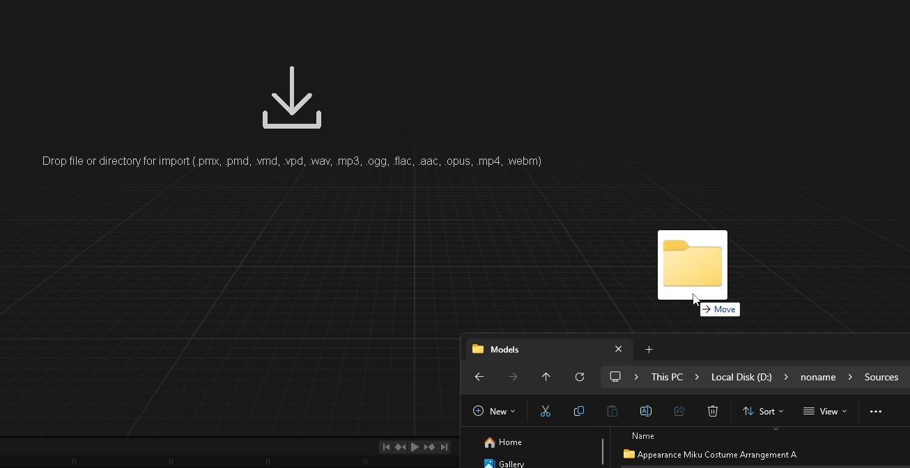
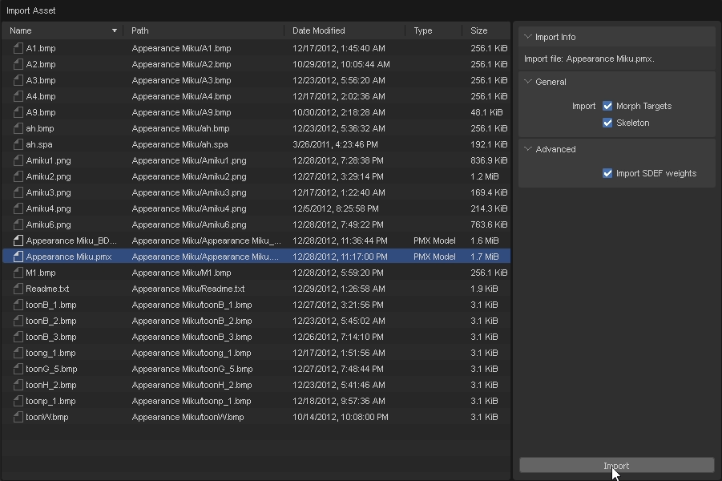
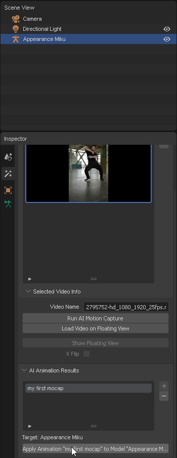
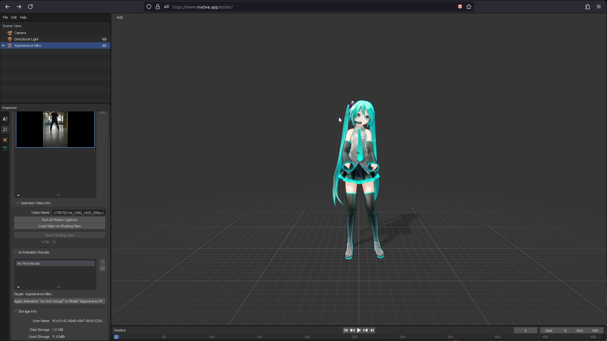
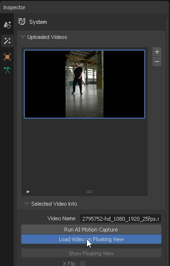
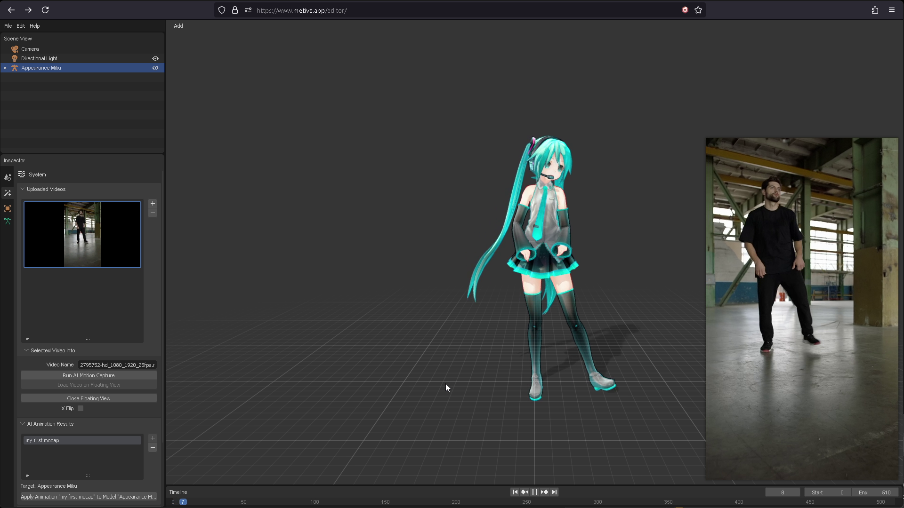

# 모델에 애니메이션 가져오기

이 섹션에서는 PMX 모델에 애니메이션을 가져오는 방법을 배웁니다.

*PMX 모델을 로드하는 예시로 [ままま](https://seiga.nicovideo.jp/seiga/im2703273) 님이 만든 "Apearance Miku"를 사용합니다.*

:::info
애니메이션이 올바르게 적용되려면 MMD 모델에 MMD 표준 본(標準ボーン)과 MMD 준표준 본(準標準ボーン)이 있어야 합니다.

Appearance Miku 모델에는 MMD 준표준 뼈대(準標準ボーン)가 **없습니다**. 따라서 최상의 결과를 위해 [Tda Miku](https://www.deviantart.com/mmd91/art/TDA-Hatsune-Miku-V4X-Style-Model-DL-Download-MMD-788834848)와 같은 다른 모델을 사용해 주세요.
:::

1. **PMX 모델이 있는 폴더**를 창에 드래그 앤 드롭합니다.

    

    :::warning
    PMX 모델 **파일**을 드래그 앤 드롭하면 텍스처 없이 모델이 로드됩니다.
    :::

2. 파일 목록에서 PMX 모델을 선택하여 "Import" 버튼을 클릭합니다.
   
    

3. "AI Animation Results" 패널에서 로드할 애니메이션을 선택하여 "Apply Animation" 버튼을 클릭합니다.
    
    

4. 애니메이션이 PMX 모델에 로드됩니다.

    

5. "Uploaded Videos" 패널에서 영상을 선택한 다음 "Load Video on Floating View" 버튼을 클릭합니다.

    

6. "floating view"에 비디오가 로드됩니다. 이제 입력한 영상과 애니메이션을 함께 볼 수 있습니다.

    

### 동영상으로 따라해보기

import ReactPlayer from "react-player";
import ResultVideo from "./2024-10-22 20-37-20.mp4";

<ReactPlayer
    url={ResultVideo}
    controls={true}
    width="100%"
    height="100%"/>
