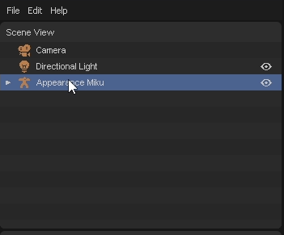

# 애니메이션 내보내기

이 섹션에서는 애니메이션을 VMD 파일로 내보내는 방법에 대해 설명합니다.

1. 내보내고 싶은 애니메이션이 있는 모델을 선택합니다.

    

2. "File" -> "Export" -> "MikuMikuDance Motion (.vmd)"순으로 클릭합니다.

    

3. 애니메이션이 VMD 파일로 내보내집니다.

    

4. 이제 내보낸 VMD 파일을 MMD 소프트웨어에서 로드할 수 있습니다.

    

### 동영상으로 따라해보기

import ReactPlayer from "react-player";
import ResultVideo from "./2024-10-22 21-02-13.mp4";

<ReactPlayer
    url={ResultVideo}
    controls={true}
    width="100%"
    height="100%"/>
