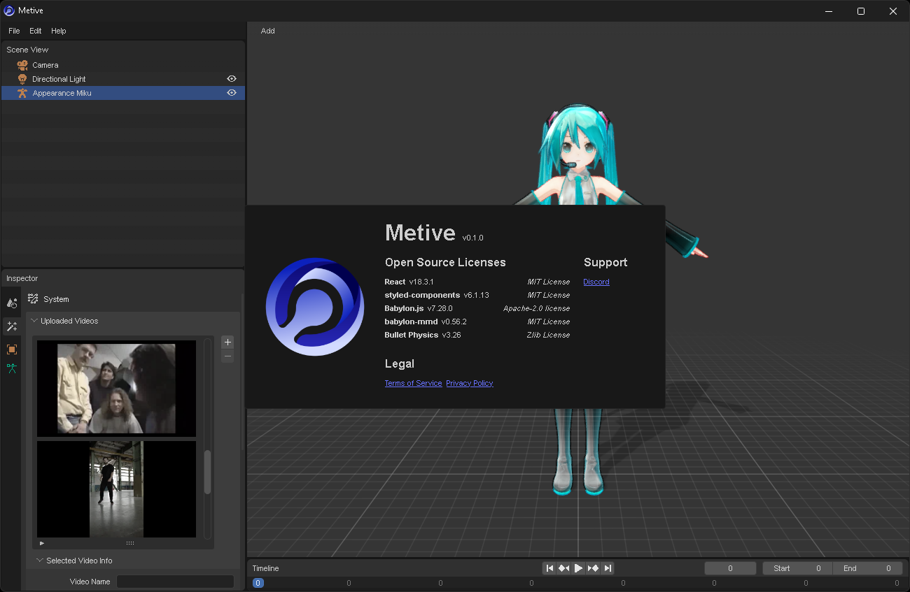

# Metive

2D 비디오에서 3D 애니메이션을 생성할 수 있는 ai 기반 모션 캡처 서비스 Metive(미티브)입니다.

## 기능

- MMD(PMX) 모델 로드
- 2D 비디오에서 3D 애니메이션 생성
- 애니메이션을 VMD 형식으로 내보내기

## 사용 방법

- [시작하기](./docs/category/getting-started) - 빠른 시작 가이드
- [FAQ](./docs/faq) - 자주 묻는 질문들

## 지원

[디스코드 서버](https://discord.gg/cUTbtaufK2)에 가입하여 지원을 받을 수 있습니다. 피드백도 남겨주세요.
