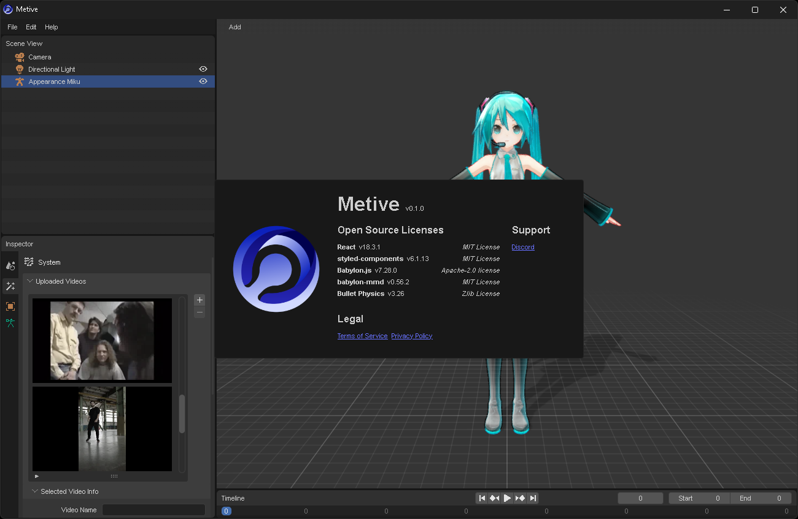

# Metive

Metive is a ai-powered motion capture service that allows you to create 3D animations from 2D videos.

## Features

- Load MMD(PMX) model
- Generate 3D animations from 2D videos
- Export animations to VMD format

## How to use
<!-- 
- [Getting Started](/docs/getting-started)
- [Features](/docs/features)
- [FAQ](/docs/faq) -->

## Support

Join our [Discord](https://discord.gg/cUTbtaufK2) server for support and feedback.

